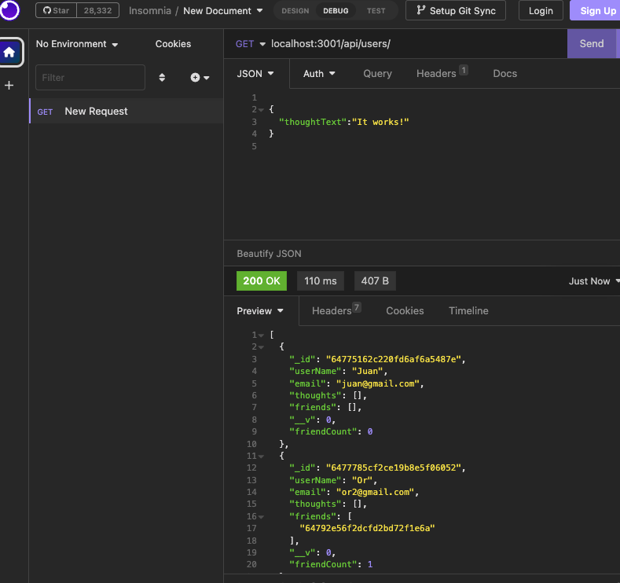

# Social Network API

## Table of Contents

- [Description](#description)
- [installation](#installation)
- [Usage](#usage)
- [License](#license)
- [Contributing](#contributing)
- [Tests](#tests)
- [Questions](#questions)

## Description

This is a social network app where users can share their thougts, react to friends' thoughts, and create a friend list.

## Installation

Express.js for routing, MongoDB database, and the Mongoose ODM.

## Usage

When a user opens API GET routes in iNSOMNIA for users and thoughts that data is for each of these eoutes is displayed in formatted JSON. When one tests API POST, PUT, DELETE routes in Insomnia, then the user can successfully create, uodate, and delete users and thoughts in their database.

## License

Licensed under the [MIT](http://choosealicense.com/licenses/mit/) license.

## Contributing

## Tests

## Questions

[The URL of the GitHub profile](https://github.com/LizaS2022).

[The link to the video walkthrough demonstrating the functionality of the application](https://drive.google.com/file/d/1jWp7syWw7apoK6Xx6AJzO4AKlG31RL9f/view).
